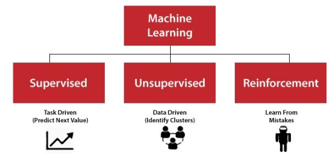
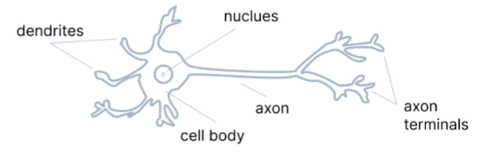
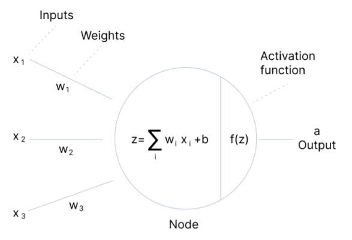
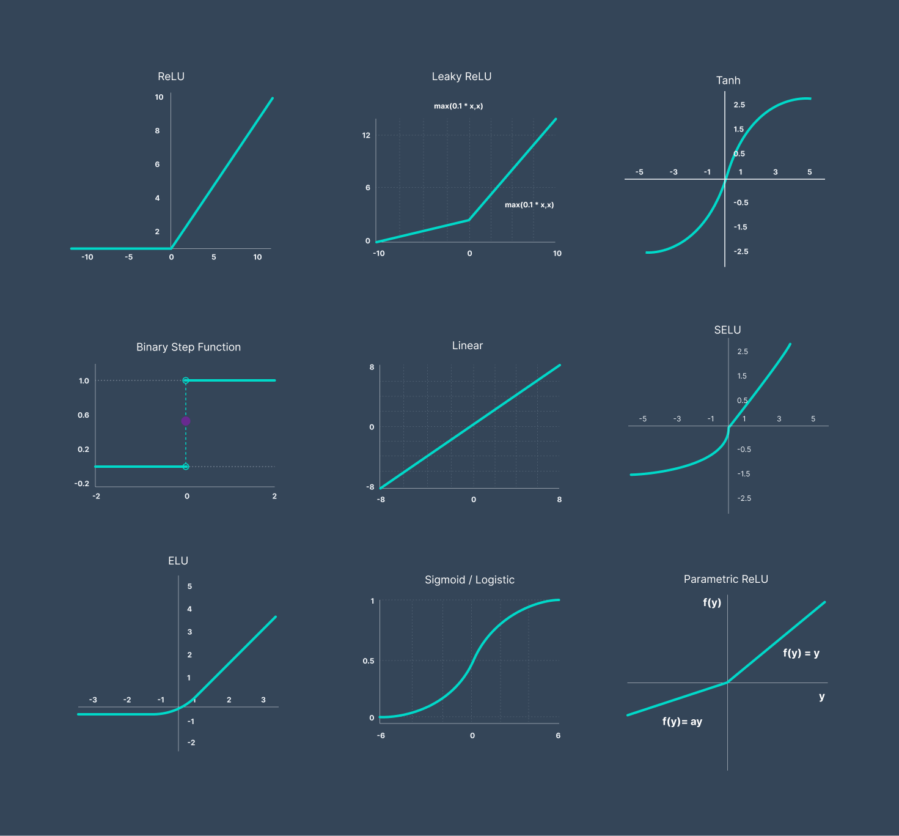
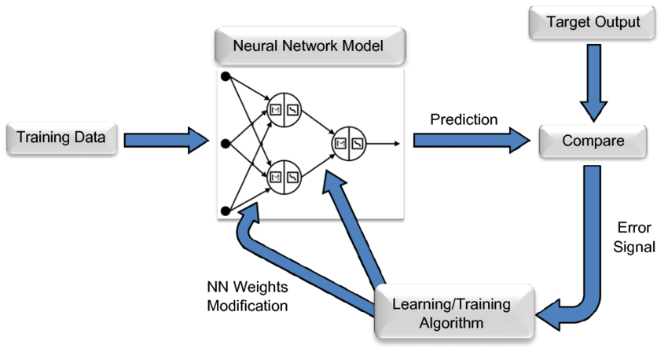
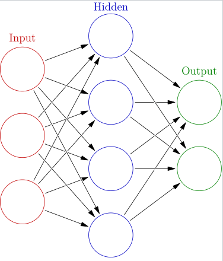
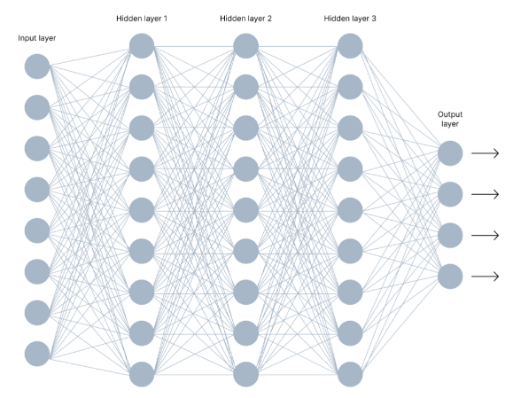

# Introduction to artificial neural networks

## Types of machine learning

Artificial neural networks is mostly related to supervised learning.

# Neurons
ANNs are composed of artificial neurons which are conceptually derived from biological neurons. Each artificial
neuron has inputs and produces a single output which can be sent to multiple other neurons. The inputs can be
the feature values of a sample of external data, such as images or documents, or they can be the outputs of 
other neurons.

Brain neuron

Artificial neurons

# Activation functions
The purpose of an activation function is to add non-linearity to the neural network. Without non-linearity, our model 
would be just a linear regression model.

# Training
 Weights will be adjusted over the training to fit the objectives we have set (recognize that a dog is a dog
 and that a cat is a cat). In simple terms: Training a Neural Network means finding the appropriate Weights 
 of the Neural Connections thanks to a feedback loop called Gradient Backward propagation

# Example types

## Feed forward networks

Each circular node represents an artificial neuron and an arrow represents a connection from the output of
one artificial neuron to the input of another.

## Deep networks

are used in:
* Classification
* Speech recognition
* Face recognition

## Convolutional Neural Networks
When it comes to image classification, the most used neural networks are Convolution Neural Networks (CNN). 
CNN contain multiple convolution layers which are responsible for the extraction of important 
features from the image.

## Recurrent Neural Networks
Recurrent Neural Networks come into picture when there’s a need for predictions using sequential data.
Sequential data can be a sequence of images, words, etc.