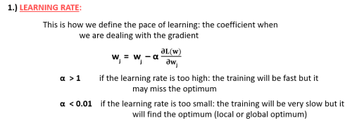
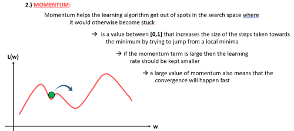
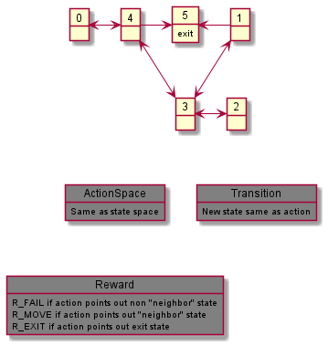

# Java based machine learning 

Most packages/folders in this repository are based on the Udemy courses:
* Artificial Intelligence II - Hands-On Neural Networks (Java)
* Artificial Intelligence III - Deep Learning in Java
* Artificial Intelligence IV - Reinforcement Learning in Java

## Neural networks variants

## Feed forward networks
Below is a feedforward network. In practice the number of layers and perceptrons (nodes) are much higher. A netork is considered as deep when the nof layers is larger than approx 4.

The weights amplify or deamplify the input signal. A small change in the weights or bias of any single perceptron in the network can sometimes cause the output of that perceptron to completely flip (for ex. 0 to 1 ). That flip may then cause the behaviour of the rest of the network to completely change in some very complicated way.
Example activation functions are sigmoid, tanh, RELU and leaky RELU. Tanh is plotted below.

Bias is like the intercept added in a linear equation. It is an additional parameter in the Neural Network which is used to adjust the output along with the weighted sum of the inputs to the neuron. Thus, Bias is a constant which helps the model in a way that it can fit best for the given data.

## Hyper parameters
Learning rate and and momentum are two hyper parameters. They are explained below.

## Stochasting gradient
Typically the network parameters (weights and biases) are updated using the gradient of loss, i.e. difference between desired and actual network output. 

## Package AI2refined
In one sub package a single perceptron model is coded. It is trained on a logic or data set. As mentioned in the course it can be used on for example XOR.
Single perceptron can't be used if input set not is linearly separable.
In another sub package, a feed forward network id developed from scratch.  

## Package AI3refined
Example datasets, XOR and IRIS, are trained using the [Deeplearning4j](https://deeplearning4j.org/) . The package requires adequate pom.xml dependencies.

## Package AI4refined
The reinforcement learning technique Q-learning is applied on a maze problem: 6 rooms.
The environment is described below.

## Package regressionnetworks
Example regression problems are solved by [Deeplearning4j](https://deeplearning4j.org/). One example is learning a network a mathematical function: sin(x)/x in the range [-10,10].

