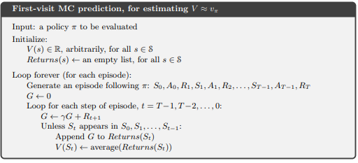
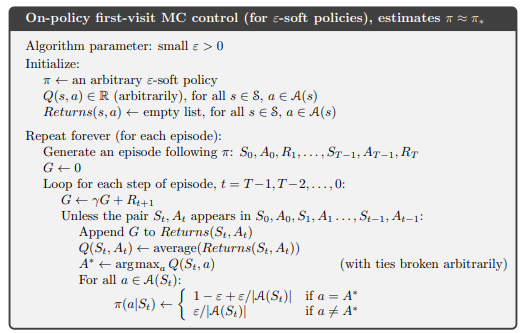
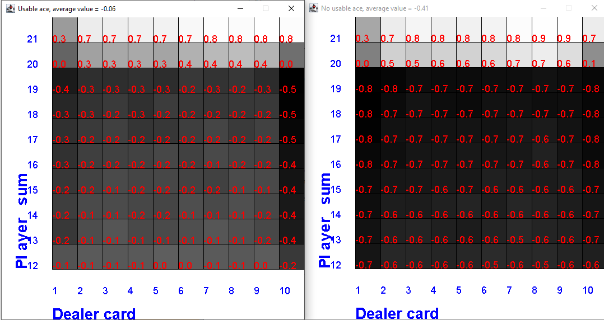
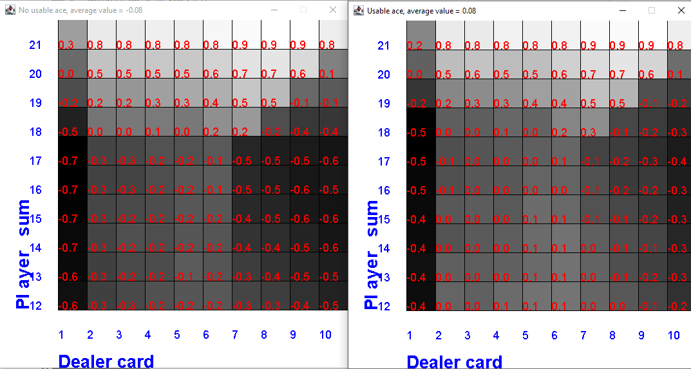
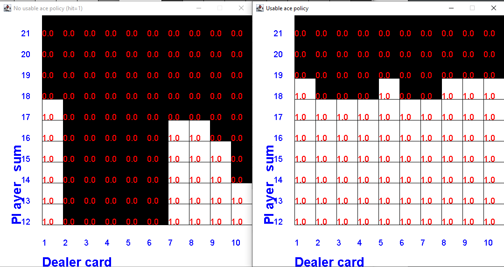
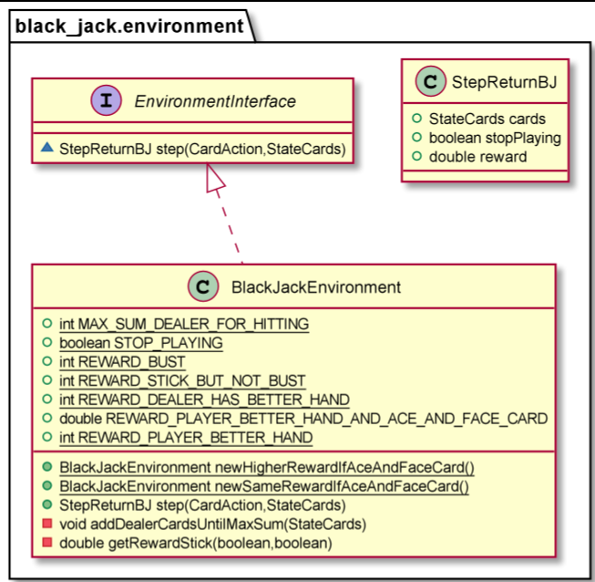

# Black jack
Blackjack is a card game where the goal is to obtain cards that sum to as
near as possible to 21 without going over. In casinos players can bet with money.
## Game rules 
A player is playing against a dealer. Face cards, Jack, Queen, King, have a point value of 10. Aces can either count as 11 or 1, 
and it's called 'usable' at 11. For example an ace is usable if the other card is a 9.
This game is placed with an infinite deck (or with replacement).
The game starts with each the player and the dealer having one face up and one
face down card.
The player can request additional cards (hit=1) until they decide to stop
(stick=0) or exceed 21 (bust).
After the player sticks, the dealer reveals their face down card, and draw a new card
until the card sum is 17 or greater. If the dealer goes bust the player wins.
If neither player nor dealer busts, the outcome (win, lose, draw) is
decided by whose sum is closer to 21.  The reward for winning is +1,
drawing is 0, and losing is -1.
An observation is the information provided to the artificial decision maker. It is a 3-tuple of: 
* the players current sum,
* the dealer's one showing card (1-10 where 1 is ace),
* whether or not the player holds a usable ace (0 or 1).
So the real state is more extensive compared to the observation.

This environment corresponds to the version of the blackjack problem
described in the book "Reinforcement Learning: An Introduction", by Sutton and Barto.

## Monte Carlo policy evaluation
We begin by considering Monte Carlo methods for learning the state-value function for a given policy. 
Recall that the value of a state is the expected return, expected cumulative future discounted reward, 
starting from the state. An obvious way to estimate it from experience, then, is simply to average 
the returns observed after visits to that state. As more return are observed, the average should 
converge to the expected value. This idea underlies all Monte Carlo methods.

Fig 1. Monte Carlo policy evaluation algorithm

## Monte Carlo control 
In on-policy control methods the policy is generally soft, meaning that  π(s,a)>0  for all  s∈S  
and all  s∈A(s) . There are many possible variations on on-policy methods. The on-policy method used ϵ -greedy policies, meaning that most of the time they choose an
action that has maximum estimated action value, but with probability ϵ  they instead select an 
action at random

Fig 2.  Monte Carlo control algorithm.

## Policy evaluation results
A rule based policy is evaluated by the algorithm in Fig 1. The rule chosen is:
hit if the sum of player cards is lower than 20. Else stick.

Fig 3. Value of rule based policy.

## Monte Carlo control results

Fig 4. Value of optimal policy.

Fig 5. Optimal policy.

## Reflections
The average value of Monte Carlo control results is higher compared to the rule based policy. Compare Fig 1 to Fig 2.
Another reflection is that the presence of a usable ace is advantageous.
For convergence, the number of episodes is in the order of millions.

## Code implementation
The code main loop is below. By using polymorphism, it is valid for both policy evaluation and control.

        for (int episodeNumber = 0; episodeNumber < nofEpisodes; episodeNumber++) {
            sometimeLogEpisodeNumber(episodeNumber);
            StateCards cards = StateCards.newRandomPairs();
            Episode episode = episodeRunner.play(cards);
            returnsForEpisode.clear();
            returnsForEpisode.appendReturns(episode);
            learner.updateMemoryFromEpisodeReturns(returnsForEpisode);
        }
Fig 6. Main code loop.

A critical method is step() in the environment class.

Fig 7.  Environment class.

