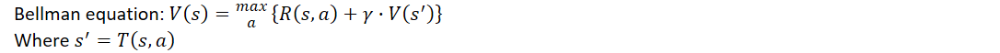
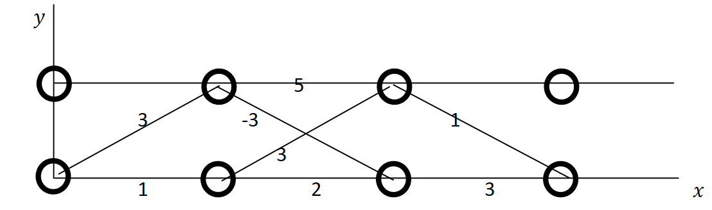
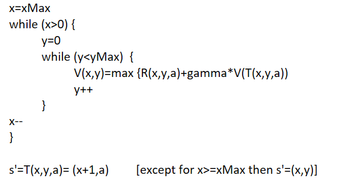
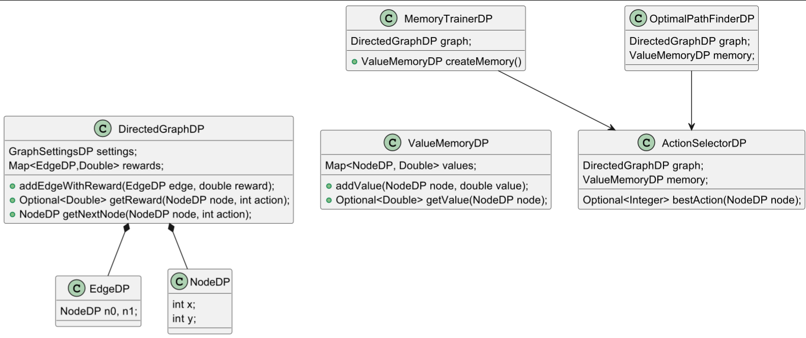

# Dynamic programming solver

The core is 

Nodes are circles in the figure below and edges are lines in between. 
Some edges are excluded for clarity. Every node is defined by x and y.
So the left lower node has x=y=0. And the right upper node has x=3, y=1.
Only one node can be start and end.
Every edge is mapped to a transition cost, also named reward. For example
In the figure below is the reward beteen node (0,0) and (1,1) 3.

The pseudocode for "training" the value function (V) is given below

where V(x,y) is the value of the node in position (x,y). V(3,0) is zero and V(2,0) is 3.

A class diagram is shown below. The main domain objects are EdgeDP, NodeDP, DirectedGraphDP and 
ValueMemoryDP. MemoryTrainerDP is executing the pseudocode above.
Both MemoryTrainerDP and OptimalPathFinderDP uses the helper class ActionSelectorDP. 

