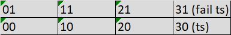

# Road maze environment

## States

## Actions

action space = {up,same,down}

## Reward model

    r=  |-100 (state=31)
        |0  (state=30)
        |-1 (action is not same)
        |0  (else)

## Transition model

    sNext:  x <- x+1
            y <- clip(0,1,yNext)

    yNext = | y+1 (a=up) 
            | y-1 (a=down)
            | y (else)
