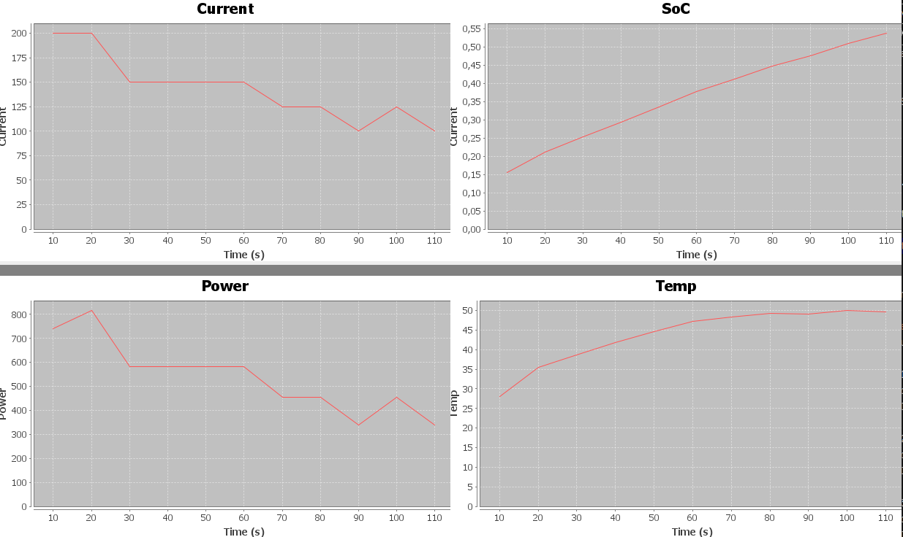

 The equations in the model used are:
*   d/dt SoC = current/capacity
*   d/dt temperature = (Qgen-Qloss)/heatCapacityCoefficient
*   Qgen=i^2*Ri,  Qloss=h*A*(temperature-temperatureAmbient)
*   ocv=f(SoC)
*   voltage=ocv+current*Ri
*   power=voltage*current

   with following constraints:
*   constraint1:  voltage<maxVoltage
*   constraint2:  temperature<maxTemperature
*   constraint3:  |power|<powerCellMax 

An example plot is presented below

