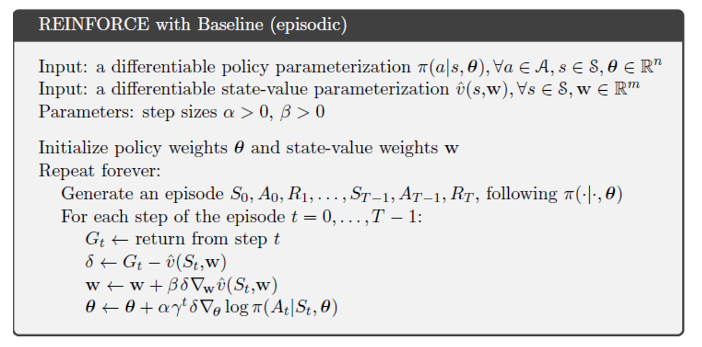

# Short corridor

Following defines the environment:
* There are three terminal states. These have either a +1 or -1 reward.
* There are 7 “real world” states. 
* There are four states that the agent can observe. Observed state 1 maps to two different real world state.
* There are two actions (0 and 1), moving left or right.
* At every step in a trial there is 1% chance of being moved to a -1 terminal state. This is needed to avoid a potential policy giving an infinite loop.

So the agent has one of three possible observed non-terminal states (0,1,2) to decide an action (0,1) from.

The transition model is
* Move to a terminal state with a specific probability, 0.01%.
* Otherwise, let the next real world state be as defined below

       state <- state + dx        
       dx= | -1 (action==0)    
           | 1  (action==1)

The policy is defined from 6 parameters, named theta_i. For a specific observed state, two of these thetas are used for action selection.
Two thetas due to two actions. For the two selected actions the action probabilites are calculated with:

### Reinforce vanilla

The problem is firs solved with REINFORCE Vanilla training algorithm, see below

The gradient of the log policy, gradLog, is defined below. In the relation i corresponds to the index of the "chosen" action (included in a <s,a,r> tuple) and
j corresponds to theta index. The term si is the present action probability of action j.

So gradLog presents the change in thetas representing the action probabilities in a specific state. For example means gradLog=[0.1,-0.1], increases theta of action 0 and decreases it for action 1.
Thetas for actions in other states are/should not be changed.

Result plots are given below. The optimal policy is to take a random action in observed state 1.

### Reinforce with Baseline

### One step Actor-Critic

